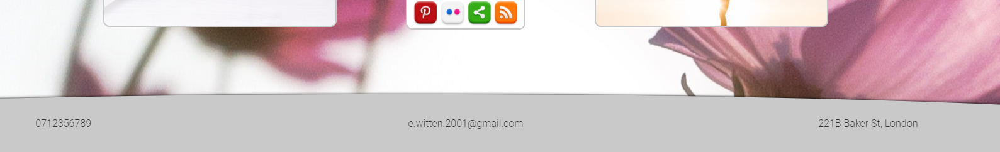

# Easy Life

The website easy life was designed to attract people who are aiming to get the most out of every day. The informtation site hopes to educate the users, so that they can stress less and adopt useful techniques such as meditation and life hacks which will relieve the stress from everyday life.

The website is availible and appicable to everybody weather that be man or woman however due to the nature of the content i have selected themes and colors that will attract a female audience. I ave developed this theme as it is more likely that women stressed out from work or home life will be more likely to use this site.

## Features

My website is designed to be as simple and as easy to navigate as possible which is why i chose to abandon the typical under the header navigation bar and encorperate a tile design into the main section of my page which will be used to navigate through the website. I believe this gives the best possible user experience and takes the modern mobile phone interface and adapts it to benifit a website layout.

### Existing Features

- __Header__

    - The header of my page contains the title on the left and the sign-up button on the right. The title is very clear and dominant on each of the 4 pages and has a border bottom which creates this button affect. This is becasue I want to make it clear to the users that it is a navigational icon and can be used at anytime to return to the home page.

    - The right side of the header shows a similarly styled button which instead reads sign-up. This is a link to the sign up page which is accesible on all of the pages also. As you hover over the button an underline appears as to show the users this this is a button.

- __The landing page__

    - The landing page has been designed to be as relaxing and as simple to navigate as possible, with bright and uplifiting colors it aims to shine light on the users day from the very beginning.

- __Tiles/Naivgation__

    - Instead of having a common naviagtion bar  as most website do, I have encorperated a simpler design which reflects that of a modern mobile phone interface. I decided to use tiles because i think it is simple, effecitve, easy to style and unique.

    - The tiles fit into the theme of the website which is meditation so instead of having messy drop down menus and complicated paths to the information you want it is made very clear and hassle free.

    - The tiles also have styling which allows them to <em>'pop out'</em> on hover and clearly display all the information of that navigation path to the user no matter the screen size.

- __Footer__

    - The footer includes the three main contact detials which are telephone, email and address. The reason I haven't included social media links is becuase there is a tile that will take the user to a page that will have a page dedicated to the social media links, describing my pages and how there support helps the company.

    - The footer also includes a curved border which I think adds a nice sleeqe design to the page.

- __Information Page__

    - The information page is set up to display an image and then some information about the practice they want to learn about.

- __Sign-up Page__

    - The sign-up page allows the users to create an account with out website. This will allow the user to add common practices and tehciques to a log so that they can visit them regularly rather than having to search through all of the information.

    - The sign-up page asks relevant questions to try and target the information present to each indicudal user. It does this by askign gender and age groups as reasons for visiting the website may change due to those variables.

- __Header/ Footer__

    - The header and footer are styled in serperate CSS files than the main body documents and then imported into the CSS sheets. This is so that they will always be dispalyed identically across all pages.

### Features to implement in the future

- Sign- up complete page
    
    - A page that you are directed to after you submit your sign-up page that thanks the user for signing up to the site.

- Quick suggestion bar
    
    - A bar under the main navigation bar the displays quick quggestions for users that are popular of new.
    
- Simple visual animation
    
    - I want a simple visual animation that makes each page come alive such as a slight travelling glow around the border of the page etc.

## Testing 

 - Most of the hours I put into developing the website were spent testing the functions and siplay to make sure everything worked correctly.

 - One of the challenges i faced was making the <em>Grid</em> responsive which took me a couple of attempts, my first attempt was scrapped due to the changing zoom on dev tools whilst selcting other screen sizes, but one i relaise this issue and started again on responsiveness i found a much easier and more efficient solution to the problem.

 - I also spent a lot of time testing background images, sizing, postitoning and coverage when altering screen sizes so that the background doesn't distort too much.

 - ### Bugs

    - One of the early bugs on my page was the title and sign-up button appearing blue on start up sometimes. I fixed this when I got spare time however this wasn't a bug that affected usability so it wasnt a priority.

    - The most major bug i came across was that when I deployed my website the background images for the grid on the meditation page wernt loading and were coming up with a 404 error in Dev tools. It took me a while but eventually i discorvered that it was becuase my source links to the images began with a <em>' / '</em> meaning that it was looking for the file from the root directory which wouldnt work. I was aware of this issue whilst i was building the site and I thought that it defintely wouldnt be an issue becuase i didnt do that with any of the other pages. This is why it took me a little longer to patch this bug.

    - Another issue was with the footer. I was struggling to get the <em>'::before'</em> element to display under the parent element. I knew that i had to use z-index to do this however i couldn't seem to work my way around the problem. Eventually i figured out the correct combination.

    - Furthermore, the footer then continued to display over the top of the grid elements which i only discorvered then testing the footer for responsiveness. This was however a quicker fix after I got used to the z-index attribute.

    - The tiles on the page without any content were not keeping size when the page size changed so i had to set specific heights for them in some of the media tags.
### Validator Testing

- HTML
    - 1 error running through HTML error, not accepting script tag (expected becuase it's HTML validator not accepting Javascript)
    
- CSS
    - No errors found on CSS validation

## Unfixed bugs

- The media links icon image is sometimes cropped on the sides by the container and i cannot find a way to keep it always that size.

- Sign-up responsivness

## Deployment

- The site was deployed to GitHub pages. The steps to deploy are as follows: 
    - In the GitHub repository, navigate to the Settings tab 
    - From the source section drop-down menu, select the Master Branch
    - Once the master branch has been selected, the page will be automatically refreshed with a detailed ribbon display to indicate the successful deployment. 

The live link can be found here - <a href="https://elliswitten.github.io/portfolio-project-1/index.html"><strong><em>Easy Life</em></strong></a>

## Credits

### Content

- The content i used can be found on this page link - <a href="https://www.mindful.org/how-to-meditate/"><strong><em>www.mindful.org</em></strong></a>

### Media

- The backround images i used were found on this page link - <a href="https://www.pexels.com/"><strong><em>www.pexels.com</em></strong></a>